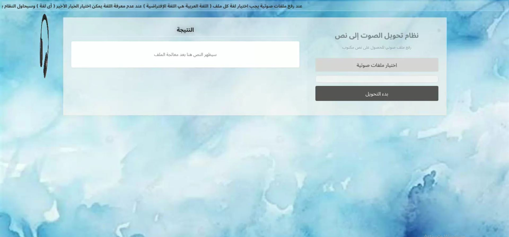
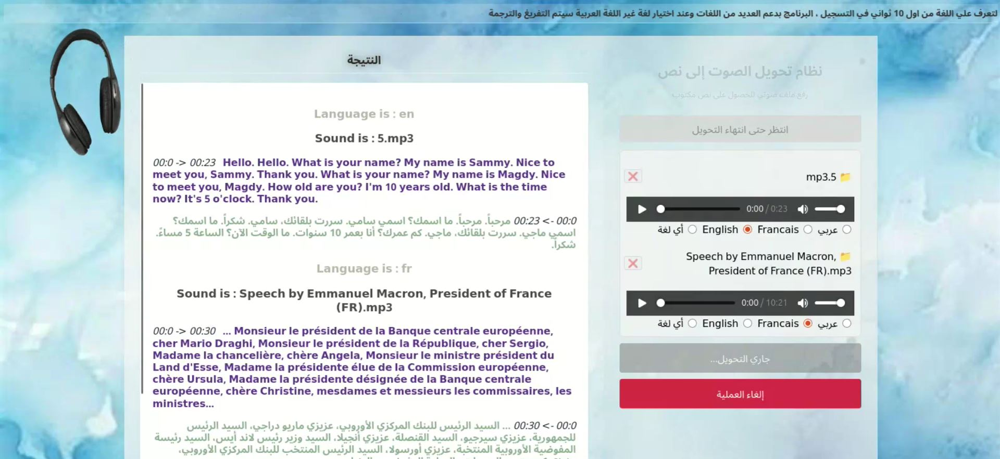
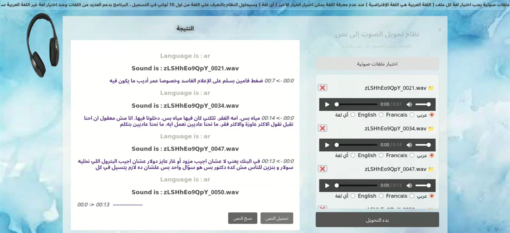

# Django AI Project with Finetuned Model for Arabic Language on Self-Collected Data




This is a Django project that integrates finetuned AI model for Arabic ASR using the Whisper Medium model on a dataset exceeding 60 hours, Whisper turbo model for the rest of Languages and NLLB model for translation. 

## Prerequisites
- Python 3.8 or higher
- Virtual environment (recommended)

## Setup Instructions

Follow these steps to set up the project locally:

1. **Clone the repository:**
   ```
   git clone https://github.com/Mahmoud-Khater/Arabic_ASR
   cd Arabic_ASR
   ```

2. **Create and activate a virtual environment:**
   ```
   python -m venv venv
   source venv/bin/activate  # On Windows: venv\Scripts\activate
   ```

3. **Install dependencies:**
   ```
   pip install -r requirements.txt
   ```

4. **Download the finetuned model weights:**
   - The model weights are not included in this repository due to their size.
   - Download the weights from [[insert link to Google Drive, Hugging Face, or other storage]](https://drive.google.com/drive/u/0/folders/1pWITwWu4r85WO62fcHn8DCsqo0OSFd3P).
   - Place the weights in the `models/` directory or any favourite place.

5. **Run migrations:**
   ```
   python manage.py migrate
   ```

6. **Start the Django development server:**
   ```
   python manage.py runserver
   ```
   - Open your browser and go to `http://127.0.0.1:8000/` to see the application.

## Project Structure

- `manage.py`: Django's command-line utility for administrative tasks.
- `audio_transcription/`: Main project directory containing settings and URL configurations.
- `voice_to_text/`: Django app containing models, views, and templates.
- `AI_Srcipts/`: Scripts for finetuning and inference with AI models.
- `templates/`: HTML templates for the Django app.
- `static/`: Static files like CSS, JavaScript, and images.
- `models/`: Placeholder for AI model weights (download separately) (Translation , turbo and checkpoint of finetuned ) or select in the code you favourite place.

## Usage

1. **Run the application:**
   - After starting the server, access the app at `http://127.0.0.1:8000/`.

2. **Using the AI Model:**
   - The finetuned model is used for Transcribe Arabic voices.:
    

## Finetuning the Model

- To finetune the model with your own data:
  ```
  accelerate launch train.py
  ```

## Notes

- Ensure you have the required AI libraries installed (e.g., PyTorch, Transformers). These are listed in `requirements.txt`.
- If you encounter issues with the model weights, verify the file integrity and compatibility with the library versions.

## Contributing

Feel free to open issues or submit pull requests if you have suggestions or improvements.
